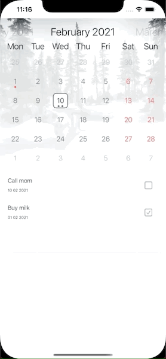

# WriteItDown
 
## Description

Simple application working as "ToDo" app which marks usere's notes on the calendar.

## Gifs

  
 

## Technologies

- CoreData
- Cocoapods (using [FSCalendar])

### Additional information

> no storyboard

## License

MIT

**Free Software, Hell Yeah!**

[//]: #
[FSCalendar]: <https://github.com/WenchaoD/FSCalendar>
